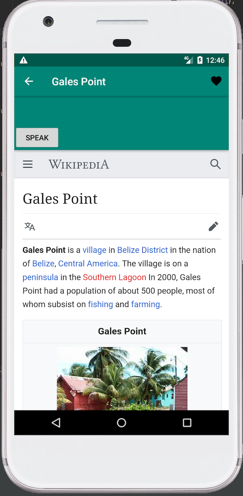

#### Group: Random Name Generator

| Team Members | GitHub Username |
| ------ | ------ |
| Francisco Guzman | csfguzman |
| Andrew Garcia | agarcia94 |
| Klaudia Hernandez | khern19 |

# About The App

> The Wiki App is an exstenion of the Wikipedia webpage but this time users
> can access it through one click of a button. In this mobile application 
> users will be able to read articles and even listen to them if deciding 
> to use the text to speech function. Users will also be able to favorite 
> articels if they wish to save it for later, and unfavorite articles if the 
> change their mind or don't need the article anymore. Then based on these favorites, 
> the user will recieve push notifications of recommened articles. In the app
> also, when users click on articles they will be saved to their history but 
> can always be cleared when wanted. Lastly, if the user already knows what 
> article they will like to see,they can always search it up within the app.

## Text to Speech
 
When clicking on an article, users will see a speak button on the left hand side above the article. When users click on that button, the article will be read out loud to them.

## Favorites

 

* Users will be able to favorite articles
* favorites will be stored in a favorites tab
* favorites will be stored into the database
* Users will be able unfavorite articles

## Push Notifications
* Based on favorites, users will recieve notifications of articles that are similar that they might like

## History

 
* When clicking onto an article, it will be saved under the user's history tab
* The user's history will still be saved even when they close the tab and reopen the app later
* The user will be able to clear their viewing history

## Search Bar

Users will be able to search up specific articles
* As the user are typing in the article, they will be given sugesstions of the possible article they are looking for

## Sources
- [Connecting Firebase to Android App](https://firebase.google.com/docs/android/setup?authuser=0#console)
